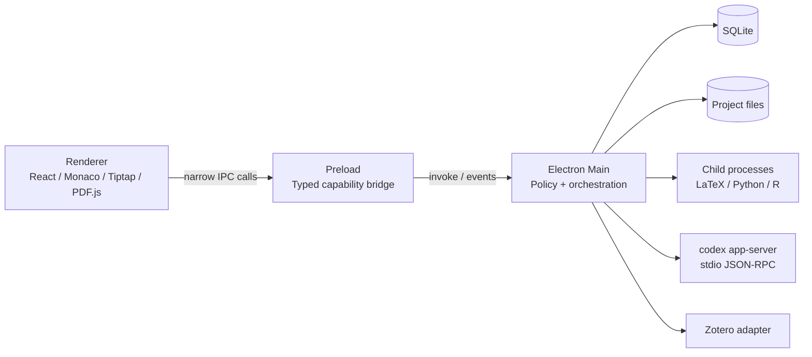

# 架构

Research IDE 是 local-first 桌面应用：正文和工程文件保存在用户选择的目录，核心能力在本机运行，网络仅用于用户明确发起的登录、模型调用、文献连接或工具链下载。应用以项目根目录作为所有文件和命令能力的默认边界。

## 进程边界

### Renderer

Renderer 只负责展示和编辑状态：

- Monaco 用于 LaTeX、Python、R 和普通文本；
- Tiptap OSS / ProseMirror 用于 `.docx` 以及经隔离 LibreOffice 往返的 `.doc` 受支持结构化子集；
- PDF.js 在 renderer worker 中渲染 PDF；
- React 维护窗口、活动栏、编辑页签、审批卡片和诊断视图。

交互控件通过集中定义的语义动作到 SVG 图标映射选择图形，按钮的可访问名称与提示文字单独提供。图标本身不使用中文字符或依赖某种界面语言的字形，因此未来接入 i18n 时只需翻译标签、菜单和选项，不需要重画工具栏图标。

Renderer 不拥有 Node.js 权限，不直接接触文件系统、SQLite、进程或凭据。所有副作用通过 preload 暴露的命名能力完成。

### Preload

Preload 是窄桥，不是第二个业务层。它通过 `contextBridge` 暴露 `project`、`files`、`documents`、`literature`、`toolchains`、`codex` 等明确方法，并把主进程事件转换为可取消订阅。它不暴露原始 `ipcRenderer`、任意 channel 或任意 shell 执行入口。

### Main process

主进程是唯一可信编排层，负责：

- 打开/创建项目，规范化路径并执行项目范围检查；
- 原子文件写入、搜索、watcher 和本地快照；
- 校验、导入并重新生成受支持的 DOCX 内容，并编排旧 DOC 的隔离转换和同源写回；
- SQLite schema 迁移和元数据索引；
- 探测并调用 LaTeX、Python、R、Pandoc 等工具链；
- 管理 `codex app-server` 生命周期、JSON-RPC、登录状态、持久对话、模型目录和审批；
- 连接 Zotero 等外部文献来源；
- 把结构化结果和经过裁剪的日志返回 renderer。

主进程服务应依赖接口而不是 UI。这样可在不扩大 preload 权限的前提下替换下载器、Zotero 连接器或后续 Rust sidecar。

## 项目与数据所有权

每次只存在一个 active project。项目正文是事实来源；`.research_ide/state.sqlite` 仅保存可重建索引、最近状态、文献映射、运行记录和快照元数据。适合文本化的稳定配置写入 `.research_ide/project.toml`，启动时使用 JSON Schema 校验。

建议布局：

| 路径 | 用途 | 可否删除后重建 |
| --- | --- | --- |
| `.research_ide/project.toml` | 可审阅、可迁移的项目配置 | 否；应先备份 |
| `.research_ide/project.schema.json` | 当前配置版本的 JSON Schema 副本 | 是，可从应用资源恢复 |
| `.research_ide/codex-policy.md` | 供项目所有者审阅的默认 Codex 边界副本；不授予权限 | 是；删除不改变运行时策略 |
| `.research_ide/state.sqlite` | 索引、UI 状态、运行元数据 | 是，正文不受影响 |
| `.research_ide/history/` | 损坏数据库隔离与恢复操作临时区 | 由对应恢复流程决定 |
| `.research_ide/backups/` | 带 manifest 与 SHA-256 的本地文件快照 | 否；删除即丢失相应本地版本 |
| `.research_ide/build/` | LaTeX 等工具生成的隔离构建产物 | 是 |
| `.research_ide/trash/` | 可恢复删除的暂存区 | 由保留策略决定 |

访问令牌、API key 和设备登录材料属于应用级机密。官方 Codex 登录强制使用操作系统凭据库；OpenAI-compatible 密钥仅驻留主进程/受控子进程内存。它们不得进入 `.research_ide/`、SQLite、Web Storage、日志、崩溃报告或备份。

## 编辑与编译数据流

1. Renderer 请求打开文件，主进程确认规范化后的路径位于项目根目录。
2. 文本由 Monaco 编辑；DOCX 经主进程校验并转换为内存中的 ProseMirror 编辑模型；DOC 先在隔离目录由受信任的 LibreOffice 转为 DOCX，再进入同一校验和编辑模型；PDF 以只读二进制流或受控 URL 交给 PDF.js。
3. 普通文本保存由主进程使用临时文件 + rename 原子替换。DOCX 保存会先检查打开时记录的源文件 SHA-256，生成并回读校验完整的新 OOXML 包，再创建 `.research_ide/backups/` 快照，最后在源文件同目录写临时文件并 rename 到同一个 `.docx` 路径。DOC 保存还会执行 DOCX→DOC→DOCX 回读与 OLE 签名/正文验证，然后以相同事务写回原 `.doc`。
4. LaTeX 编译等任务只允许选择已探测/已配置的可执行文件，参数以数组传递，工作目录固定在项目内。
5. stdout/stderr 以带 run id 的事件流返回，退出状态转成 Problems/Output，而不是把终端控制权交给页面。

DOCX 编辑以原 `.docx` 为事实来源，不要求用户先转换为另一种文稿格式。打开时使用 Mammoth 提取语义结构，再经过 HTML 白名单清理；保存时由 `docx` 重新生成 OOXML。因此这是明确限定的结构化编辑路径，而不是对原包做无损补丁：文本、标题、列表、表格、链接和受支持图片可编辑，分页、主题样式及高级 Word 结构可能被简化。`.doc` 对用户同样保持原扩展名和源路径，但底层依赖 LibreOffice 做有损兼容往返。详细边界见 [DOCX 支持范围](docx-support.md) 与 [旧版 DOC 支持](legacy-doc-support.md)。

## 工具链选择

打开项目后，主进程会为该项目会话在后台执行一次固定候选名单的版本探测；首次打开工具箱会复用同一个任务，不会重复扫描，探测也不会占用文件保存使用的全局变更队列。解析项目绑定时，`system` 只从继承的 `PATH` 与少量固定系统目录解析（macOS 包括常见 Homebrew、TeX 和 R Framework 位置），`managed` 只允许 Research IDE 用户数据目录下 `toolchains/` 的相对路径，`custom` 只有在用户曾通过系统文件选择器确认同一规范路径且当前 SHA-256 未变化时才可自动绑定，并会在实际运行前再次核对。用户可把系统检测结果设为项目默认；确认后的选择经过 schema 校验并原子写回 `.research_ide/project.toml`。

LaTeX 首先探测系统发行版。工具箱同时提供类似 Hub 的本地版本列表：当前 provider 以 conda-forge 为软件包来源，以带 GitHub SHA-256 摘要的 Pixi release 为引导管理器，把每个版本安装到用户数据 `toolchains/<tool>/<version>/`。安装记录最后提交，启动和运行前都复核可执行文件哈希；项目配置只保存此目录下的相对路径。系统版本、自定义版本和多个受管版本可以并存，详细边界见 [本地工具版本中心](managed-toolchains.md)。

## 界面与策略呈现

标题栏仅保留有独立行为的文件菜单和统一“指令中心”菜单按钮，编辑/视图/运行/帮助不再以四个等价入口重复出现；左侧活动栏不再重复提供全项目搜索面板，快速打开文件和编辑器内搜索仍保留。全局默认字号提高到 14 px，正文编辑器使用 16 px，关键控件文字不低于约 11 px。Codex 面板使用“智能体”这一面向科研用户的称呼，可列出、恢复、切换、归档和删除 app-server 持久对话，并从 `model/list` 动态显示模型及其支持的思考强度。面板只在人工回退确实需要决策时显示审批卡片；原生自动审查状态进入执行时间线。这个界面精简不改变安全模型：路径、IPC、命令、凭据和 Codex 审批仍由主进程与 app-server 配置执行；新项目中的 `.research_ide/codex-policy.md` 只是供人审阅的策略副本。

Codex 可执行文件首先从继承的可信 `PATH` 发现；macOS 还检查 Finder 启动应用时常缺失的 `/opt/homebrew/bin`、`/usr/local/bin`、`/opt/local/bin`、`/usr/bin` 与 `/bin`，所有候选及传给子进程的 PATH 目录都必须位于当前项目之外。OpenAI-compatible 连接支持有密钥和无鉴权端点；无密钥时 app-server 配置不会声明 `env_key`。

Python 可通过独立环境/版本管理器扩展；R 和其他编译器使用相同的 provider 接口。调用一律通过 `spawn(executable, args, { shell: false })`，不拼接 shell 字符串；长任务进入独立 POSIX process group，Windows 使用系统 task-tree 终止机制。

## 可演进点

- 文献服务以 adapter 隔离 Zotero 本地 API、Better BibTeX 和未来插件；
- 工具链 provider 隔离系统检测与托管下载；
- Codex transport 隔离 app-server 协议版本差异；
- 后续 Rust sidecar 可承接高风险的文件系统、归档校验或下载操作，但不改变 renderer API；
- 插件平台将需要独立 manifest、签名、权限声明与进程隔离，本 MVP 不预留“任意 JS 注入”捷径。
